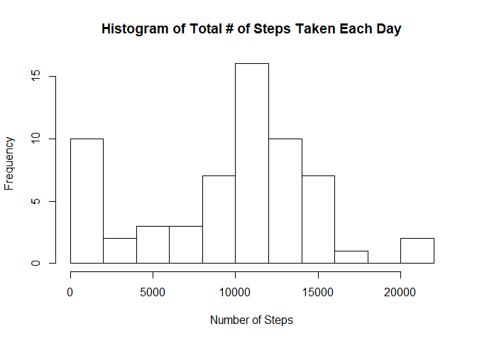
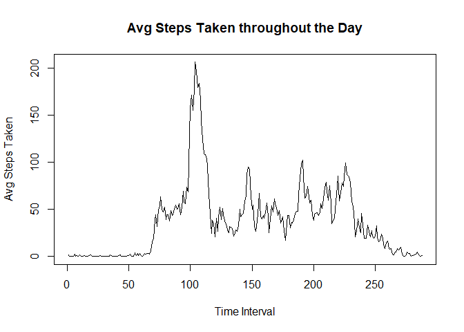
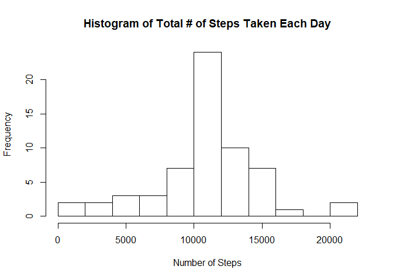
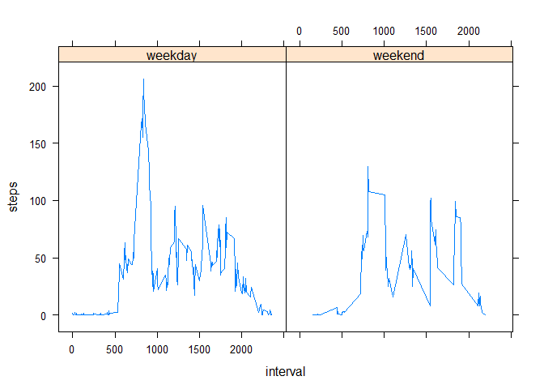

## Introduction

This is a simple analysis of the a wearable activity log, completed as part of the Reproducible Research
Peer Assignment.  The dataset consists of 3 variables:  

- steps: Number of steps taking in a 5-minute interval (missing values are coded as NA)  
- date: The date on which the measurement was taken in YYYY-MM-DD format  
- interval: Identifier for the 5-minute interval in which measurement was taken

## Preliminary Steps
After setting your working directory and downloading the appropriate data set, read the data in with the 
following code.


```r
library(dplyr) 
```

```
## Warning: package 'dplyr' was built under R version 3.3.3
```

```
## 
## Attaching package: 'dplyr'
```

```
## The following objects are masked from 'package:stats':
## 
##     filter, lag
```

```
## The following objects are masked from 'package:base':
## 
##     intersect, setdiff, setequal, union
```

```r
act_data <- read.csv(unzip("activity.zip"))
```

Next, let's check the class of the variables and look at a quick summary.


```r
str(act_data)
```

```
## 'data.frame':	17568 obs. of  3 variables:
##  $ steps   : int  NA NA NA NA NA NA NA NA NA NA ...
##  $ date    : Factor w/ 61 levels "2012-10-01","2012-10-02",..: 1 1 1 1 1 1 1 1 1 1 ...
##  $ interval: int  0 5 10 15 20 25 30 35 40 45 ...
```

```r
summary(act_data)
```

```
##      steps                date          interval     
##  Min.   :  0.00   2012-10-01:  288   Min.   :   0.0  
##  1st Qu.:  0.00   2012-10-02:  288   1st Qu.: 588.8  
##  Median :  0.00   2012-10-03:  288   Median :1177.5  
##  Mean   : 37.38   2012-10-04:  288   Mean   :1177.5  
##  3rd Qu.: 12.00   2012-10-05:  288   3rd Qu.:1766.2  
##  Max.   :806.00   2012-10-06:  288   Max.   :2355.0  
##  NA's   :2304     (Other)   :15840
```

## Mean Steps Per Day
Now let's take a look at the mean total number of steps taken per day.  


```r
hist(tapply(act_data$steps,act_data$date, sum, na.rm=TRUE), n=10, main=
      "Histogram of Total # of Steps Taken Each Day", xlab="Number of Steps")
```

<!-- -->

The distribution looks pretty normal with the average day being about 11,000 to 12,000 steps.  We also see
that we have about 10 days with 0 steps.

To be exact, let's calculate the mean and median number of steps taken per day.

```r
mean(tapply(act_data$steps,act_data$date, sum, na.rm=TRUE))
```

```
## [1] 9354.23
```

```r
median(tapply(act_data$steps,act_data$date, sum, na.rm=TRUE))
```

```
## [1] 10395
```

So, as expected from the histogram, we see the mean driven down by the significant number of days with 0 steps.

## Average Daily Activity Pattern
We now move to exploring activity patterns throughout the day.  Let's define an object that looks at average
steps (across days) for each time interval.


```r
time_avg <- tapply(act_data$steps, act_data$interval, mean, na.rm=TRUE)
```
Now we plot this object to see what average activity looks like throughout the course of the day.


```r
plot(time_avg, type="l", xlab="Time Interval", ylab="Avg Steps Taken", main= "Avg Steps Taken throughout the Day")
```

<!-- -->

So it looks like the busiest interval of the day is right around the 110th.  Let's calculate this to be exact.

```r
max(time_avg)
```

```
## [1] 206.1698
```
So the max is 206 and it occurs at interval

```r
which(time_avg==max(time_avg))[[1]]
```

```
## [1] 104
```

## Missing Value Imputations
Thus far in our analysis, we've ignored the presence of missing values.  Perhaps there is a treatment we could
apply that would be more sophisticated than simply removing them.

Let's check how many rows we have missing values for.

```r
sum(is.na(act_data$steps))
```

```
## [1] 2304
```

This is about 13% of our total observations.  Let's take the avg steps taken for each interval that's missing
as the imputed value.  To do this we'll join the avg values for each interval for the entire dataset, then 
create a new dataset where we replace the missing values with the averages.


```r
avg_vals <- aggregate(act_data$steps, list(act_data$interval), mean, na.rm=TRUE)
avg_vals <- rename(avg_vals, interval=Group.1, avg_steps=x )
imp_act_data <- merge(act_data, avg_vals)
imp_act_data$steps <- ifelse(!is.na(imp_act_data$steps),imp_act_data$steps,imp_act_data$avg_steps)
```
Now that we have our new imputed datastep, lets take another look at a histogram of total avg steps taken
per day as well as the mean and median values.  With this we can see how our new dataset compares to the old.


```r
hist(tapply(imp_act_data$steps,imp_act_data$date, sum, na.rm=TRUE), n=10, main=
      "Histogram of Total # of Steps Taken Each Day", xlab="Number of Steps")
```

<!-- -->

```r
mean(tapply(imp_act_data$steps,imp_act_data$date, sum, na.rm=TRUE))
```

```
## [1] 10766.19
```

```r
median(tapply(imp_act_data$steps,imp_act_data$date, sum, na.rm=TRUE))
```

```
## [1] 10766.19
```
With our imputations, it seems our distribution has shifted slightly right.  Also, our mean and median have increased.

## Comparing Weekend and Weekday activity Patterns
We now turn our attention to exploration of whether or not step behaviors differ by weekday vs. weekend.
We continue to utilize our imputed dataset.  Let's create a factor variable that indicates whether the day is
a weekday or weekend.


```r
imp_act_data <- mutate(imp_act_data, weekday= ifelse(weekdays(as.POSIXlt(act_data$date)) %in% 
                                             c("Saturday","Sunday"),"weekend","weekday"))
```

```
## Warning: package 'bindrcpp' was built under R version 3.3.3
```
Now let's examine a panel plot of the average steps taken in each interval for weekends compared to weekdays


```r
w_avg_vals <- aggregate(steps ~ weekday+interval, data=imp_act_data , mean, na.rm=TRUE)
head(w_avg_vals)
```

```
##   weekday interval     steps
## 1 weekday        0 1.7169811
## 2 weekday        5 0.3396226
## 3 weekday       10 0.1320755
## 4 weekday       15 0.1509434
## 5 weekday       20 0.0754717
## 6 weekday       25 2.0943396
```

```r
library(lattice)
xyplot(steps ~ interval | weekday, type="l", data= w_avg_vals)
```

<!-- -->

From our graphic, we see that weekends tend to have less variation in avg steps.  Also they have a more regularized pattern.

This concludes our analysis.  Thank you for reading!!
